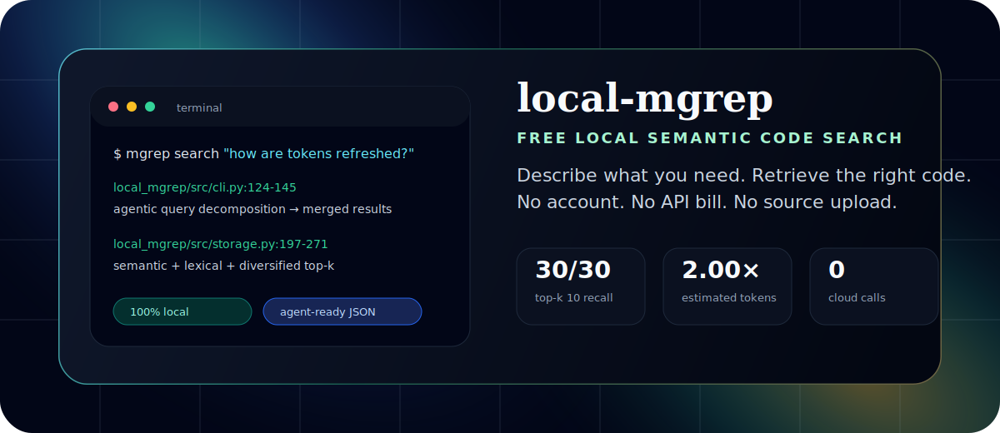

<p align="center">
  
</p>

<p align="center">
  <a href="https://pypi.org/project/local-mgrep/"></a>
  
  
  
  
</p>

<h3 align="center">Semantic code search for people and coding agents — fully local, free, and private.</h3>

`local-mgrep` is a local-first semantic code search CLI. It lets you ask a
repository questions in natural language, retrieves the relevant code snippets,
and returns line-level provenance for humans, scripts, and coding agents.

It is inspired by the original hosted `mgrep` workflow, but intentionally keeps
the core system on your machine: local Ollama embeddings, local SQLite vectors,
local ranking, optional local answer synthesis, and no hosted account or paid API
requirement.

```bash
pip install local-mgrep
ollama pull mxbai-embed-large

mgrep index /path/to/repo --reset
mgrep search "where is token refresh implemented?" -m 10 --json
```

## Why this exists

Modern coding agents waste enormous context on broad file reads and repeated
exact searches. `local-mgrep` gives them a better first move: retrieve a compact,
ranked, source-cited context pack before reading files deeply.

| You need | local-mgrep gives you |
| --- | --- |
| Find code by intent, not keywords | Natural-language semantic search over a local repo |
| Keep private repos private | No code upload, no hosted index, no login |
| Give agents smaller context | Stable JSON snippets with path and line ranges |
| Avoid cloud reranker costs | Local hybrid semantic + lexical ranking |
| Improve top-k recall | Per-file result diversification before final output |
| Stay current while editing | Incremental indexing and watch mode |

## What it can do

### Search by meaning

```bash
mgrep search "how does the authentication token get refreshed?"
```

The query is embedded locally, compared against indexed code chunks, reranked
with exact code-term matches, deduplicated by source span, diversified across
files, and returned with provenance.

### Emit agent-ready JSON

```bash
mgrep search "where is the SQLite schema initialized?" --json -m 10
```

```json
[
  {
    "path": "local_mgrep/src/storage.py",
    "start_line": 31,
    "end_line": 47,
    "language": "python",
    "score": 0.824,
    "snippet": "CREATE TABLE IF NOT EXISTS chunks ..."
  }
]
```

### Filter like a practical developer tool

```bash
mgrep search "auth token" -m 10 \
  --language python \
  --include "src/*" \
  --exclude "*_test.py"
```

### Synthesize local answers

```bash
ollama pull qwen2.5:3b
OLLAMA_LLM_MODEL=qwen2.5:3b mgrep search \
  "how does indexing remove deleted files?" \
  --answer
```

Answer mode uses retrieved snippets as local context and cites the source files.
It does not call a paid model API.

### Use bounded local agentic search

```bash
mgrep search "how are tokens created, validated, and refreshed?" \
  --agentic --max-subqueries 3 --answer
```

Agentic mode asks a local Ollama model to split a broad question into bounded
subqueries, searches each locally, merges/deduplicates results, and then answers
from the retrieved context.

### Keep the index warm

```bash
mgrep watch /path/to/repo --interval 5
```

Watch mode adds, updates, and deletes index rows as the project changes.

## Benchmark snapshot

<p align="center">
  
</p>

Current deterministic benchmark on this repository:

| Condition | Result |
| --- | ---: |
| Tasks | 30 repository navigation questions |
| Baseline | grep-agent simulation with exact-term searches and matching line windows |
| Treatment | one local-mgrep semantic search per task |
| Best current default | `-m 10` / top-k 10 |
| Expected-file recall | `30/30` for grep-agent and `30/30` for local-mgrep |
| Estimated total-token reduction | `2.00x` at top-k 10 |
| Context-token reduction | `2.90x` at top-k 10 |
| Tool calls | `30` local-mgrep calls vs `227` grep-agent searches |

Important: this is a deterministic local context-gathering benchmark. It is not
provider billing data and not a full answer-quality evaluation. The benchmark is
included so you can rerun it, inspect the methodology, and avoid hand-wavy token
claims.

```bash
.venv/bin/python benchmarks/token_savings.py --top-k 5
.venv/bin/python benchmarks/agent_context_benchmark.py --top-k 10 --summary-only
```

See [`docs/token-benchmarking.md`](docs/token-benchmarking.md) for definitions,
tradeoffs, and the full benchmark protocol.

## Local architecture

<p align="center">
  
</p>

The pipeline is deliberately simple and inspectable:

1. **Collect files** — scan source files while respecting `.gitignore`,
   `.mgrepignore`, and common generated/vendor directories.
2. **Chunk code** — use tree-sitter where available, with a robust text fallback.
3. **Embed locally** — call Ollama embedding models such as `mxbai-embed-large`
   or `nomic-embed-text`.
4. **Store locally** — persist chunks, vectors, metadata, and line ranges in
   SQLite at `MGREP_DB_PATH`.
5. **Rank locally** — score with vector similarity, optional lexical boosting,
   logical deduplication, and result diversification.
6. **Return context** — print human-readable snippets, stable JSON, or a local
   synthesized answer.

## Installation

### From PyPI

```bash
pip install local-mgrep
```

### From source

```bash
git clone https://github.com/danielchen26/local-mgrep.git
cd local-mgrep
python3 -m venv .venv
source .venv/bin/activate
pip install -e .
```

### Ollama setup

Install Ollama from <https://ollama.com>, then pull an embedding model:

```bash
ollama pull mxbai-embed-large
# or
ollama pull nomic-embed-text
```

Optional local answer/agentic mode model:

```bash
ollama pull qwen2.5:3b
```

## CLI reference

### `mgrep index`

```bash
mgrep index [PATH] [--reset] [--incremental/--full]
```

Build or update the local SQLite index.

### `mgrep search`

```bash
mgrep search QUERY [OPTIONS]
```

| Option | Purpose |
| --- | --- |
| `-m`, `-n`, `--top` | Number of final results |
| `--json` | Emit stable JSON for agents/scripts |
| `--answer` | Synthesize a local answer from retrieved snippets |
| `--content / --no-content` | Show or hide snippet bodies |
| `--language` | Restrict by language |
| `--include` | Include only matching paths |
| `--exclude` | Exclude matching paths |
| `--semantic-only` | Disable lexical boosting and use pure vector scoring |
| `--agentic` | Locally decompose broad questions into subqueries |
| `--max-subqueries` | Cap local agentic subqueries |

### `mgrep stats`

```bash
mgrep stats
```

Show total chunks and indexed files.

### `mgrep watch`

```bash
mgrep watch [PATH] --interval 5
```

Continuously refresh the index while you edit.

## Configuration

| Variable | Default | Description |
| --- | --- | --- |
| `OLLAMA_URL` | `http://localhost:11434` | Local Ollama server URL |
| `OLLAMA_EMBED_MODEL` | `mxbai-embed-large` | Embedding model for indexing/search |
| `OLLAMA_LLM_MODEL` | `qwen2.5:3b` | Local model for `--answer` and `--agentic` |
| `MGREP_DB_PATH` | `~/.local-mgrep/index.db` | SQLite vector index location |

## Capability matrix

| Capability | Status | Notes |
| --- | --- | --- |
| Semantic code search | ✅ Implemented | Local Ollama embeddings |
| Tree-sitter chunking | ✅ Implemented | Python, JS/TS, and broader extension-aware fallback support |
| `.gitignore` / `.mgrepignore` hygiene | ✅ Implemented | Also skips common generated/vendor dirs |
| Incremental indexing | ✅ Implemented | Adds/updates changed files |
| Stale deletion cleanup | ✅ Implemented | Removes deleted file chunks |
| Watch mode | ✅ Implemented | Polling local file watcher |
| Hybrid lexical + semantic ranking | ✅ Implemented | Pure semantic available with `--semantic-only` |
| Result diversification | ✅ Implemented | Caps repeated chunks per file before final top-k |
| Stable JSON output | ✅ Implemented | Designed for agents/scripts |
| Local answer mode | ✅ Implemented | Uses local Ollama generation model |
| Local agentic decomposition | ✅ Implemented | Bounded subquery expansion via Ollama |
| Hosted account / cloud index | 🚫 Intentionally absent | This project is local-first |
| Paid API dependency | 🚫 Intentionally absent | No API key required for core workflow |

For deeper implementation notes, see
[`docs/local-mgrep-0.2.0.md`](docs/local-mgrep-0.2.0.md).

## Design principles

- **Local by default.** Your source, vectors, and generated answers stay on your
  workstation.
- **Agent-friendly, human-readable.** Every result carries path, line range,
  language, score, and snippet.
- **Honest benchmarks.** Token savings are reported with definitions and caveats,
  not as unverifiable marketing claims.
- **Small enough to inspect.** The core implementation is Python, Click, NumPy,
  SQLite, tree-sitter, and Ollama.
- **Free to run.** No hosted subscription is required for the core search loop.

## Roadmap

Near-term local-first improvements:

- MCP server / editor integration for coding agents.
- Larger multi-repository benchmark suite.
- Configurable local reranking over a larger candidate pool.
- Richer ignore semantics and language coverage.
- Packaged benchmark fixtures for third-party reproducibility.

## Development

```bash
python3 -m venv .venv
source .venv/bin/activate
pip install -e .

.venv/bin/python -m unittest discover tests
.venv/bin/python -m py_compile local_mgrep/src/*.py tests/*.py benchmarks/*.py
```

Benchmark locally:

```bash
.venv/bin/python benchmarks/token_savings.py --top-k 5
.venv/bin/python benchmarks/agent_context_benchmark.py --top-k 10 --summary-only
```

## License

MIT — see [`LICENSE`](LICENSE).

## Acknowledgments

- [Ollama](https://ollama.com/) for local embedding and generation models.
- [tree-sitter](https://tree-sitter.github.io/tree-sitter/) for syntax-aware parsing.
- Click, NumPy, scikit-learn, and SQLite for the lightweight local runtime.
