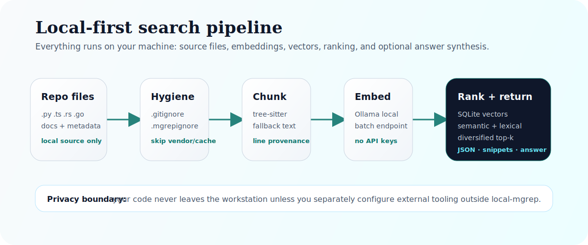
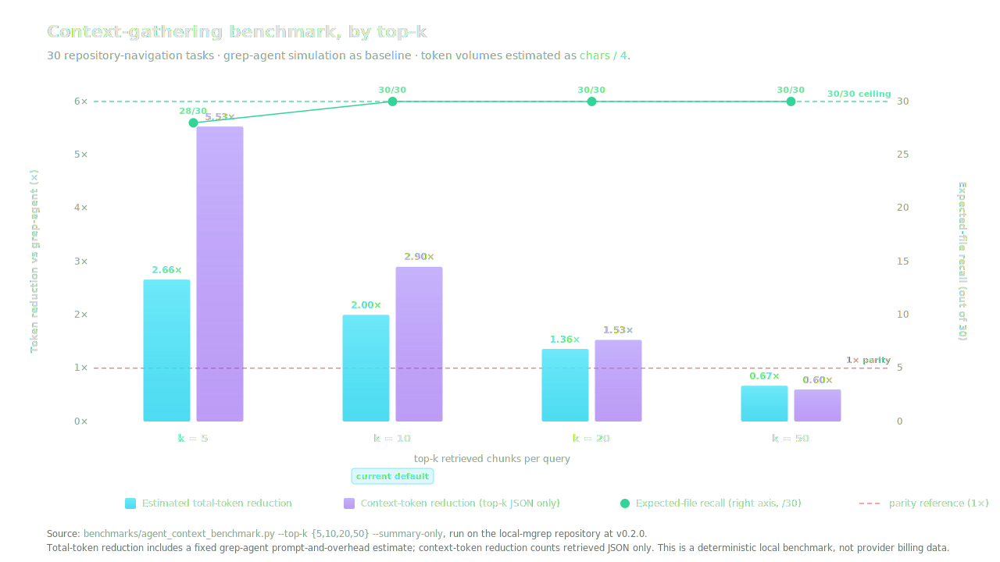

<p align="center">
  
</p>

<p align="center">
  <a href="https://pypi.org/project/local-mgrep/"></a>
  <a href="https://www.python.org/downloads/"></a>
  <a href="LICENSE"></a>
  <a href="https://danielchen26.github.io/local-mgrep/"></a>
</p>

<p align="center">
  <a href="https://danielchen26.github.io/local-mgrep/"><b>Documentation</b></a>
  &nbsp;·&nbsp;
  <a href="#quickstart"><b>Quickstart</b></a>
  &nbsp;·&nbsp;
  <a href="#architecture"><b>Architecture</b></a>
  &nbsp;·&nbsp;
  <a href="#benchmark"><b>Benchmark</b></a>
  &nbsp;·&nbsp;
  <a href="https://github.com/danielchen26/local-mgrep/issues"><b>Issues</b></a>
</p>

---

## Overview

A query is embedded with the same Ollama model used at index time, compared
by cosine similarity against every chunk in the repository, lexically reranked
by token and phrase overlap, span-deduplicated, and per-file diversified
before the top-k is returned. Indexing, retrieval, and optional answer
generation all run on the local host. No remote service is required for the
core workflow.

Each result carries a file path, an inclusive 1-based line range, the
detected language, the score, and the verbatim source text. The same
structure is rendered as text, JSON (`--json`), or as a synthesized answer
from a local generation model (`--answer`).

## Quickstart

```bash
# 1. Install
pip install local-mgrep

# 2. Pull a local embedding model (one-time)
ollama pull mxbai-embed-large

# 3. Index your repository
mgrep index /path/to/repo --reset

# 4. Ask in natural language
mgrep search "where is the auth token refreshed?" -m 10
```

For machine-readable output suitable for scripts and coding agents:

```bash
mgrep search "where is the SQLite schema initialized?" -m 10 --json
```

To synthesize an answer from the retrieved snippets via a local Ollama
generation model (the original ranked sources are still printed below):

```bash
ollama pull qwen2.5:3b
mgrep search "how does indexing remove deleted files?" --answer
```

To decompose a broad question into bounded local subqueries:

```bash
mgrep search "how are tokens created, validated, and refreshed?" \
  --agentic --max-subqueries 3 --answer
```

Full CLI reference and configuration: <https://danielchen26.github.io/local-mgrep/>.

## Architecture

<p align="center">
  
</p>

The index pipeline (`mgrep index`, `mgrep watch`) and the query pipeline
(`mgrep search`) communicate only through a SQLite database stored at
`$MGREP_DB_PATH`. The two pipelines share no in-process state and can run
on different hosts as long as they point at the same database file.

The full set of internal modules is documented at
<https://danielchen26.github.io/local-mgrep/#architecture>.

## Capability matrix

| Capability | Status | Notes |
| --- | --- | --- |
| Semantic code search | implemented | Local Ollama embeddings. |
| Tree-sitter chunking | implemented | Languages with installed grammars; line-window fallback otherwise. |
| `.gitignore` / `.mgrepignore` hygiene | implemented | Plus a built-in skip-set for common build/cache directories. |
| Incremental indexing | implemented | mtime-based; reindexes new and changed files. |
| Stale row cleanup | implemented | Removes rows for files no longer present beneath the indexed root. |
| Watch mode | implemented | Polling loop; default interval 5 seconds. |
| Hybrid lexical + semantic ranking | implemented | Disable with `--semantic-only` for pure cosine. |
| Result diversification | implemented | Per-file cap of 2 chunks before final top-k. |
| Stable JSON output | implemented | See [JSON schema](https://danielchen26.github.io/local-mgrep/#json-schema). |
| Local answer mode | implemented | Uses local Ollama generation model. |
| Local agentic decomposition | implemented | Bounded subquery expansion via Ollama. |
| Hosted account / cloud index | out of scope | Not planned. |
| Paid web search | out of scope | Not planned. |

## Benchmark

<p align="center">
  
</p>

Deterministic local benchmark over 30 repository navigation tasks. Compares
a single `mgrep search` call against a grep-agent simulation. Token volumes
are estimated as `chars / 4`.

| top-k | recall (mgrep) | recall (grep) | total-token reduction | context-token reduction |
| ----: | :------------- | :------------ | :-------------------- | :---------------------- |
| 5     | 28 / 30        | 30 / 30       | 2.66×                 | 5.53×                   |
| **10** | **30 / 30**    | **30 / 30**   | **2.00×**             | **2.90×**               |
| 20    | 30 / 30        | 30 / 30       | 1.36×                 | 1.53×                   |
| 50    | 30 / 30        | 30 / 30       | 0.67×                 | 0.60×                   |

Top-k 10 is the only setting where local-mgrep matches grep-agent recall
while keeping the estimated total-token reduction above 1×. This is a
deterministic local benchmark, not provider billing data; full methodology
and limitations are in [`docs/token-benchmarking.md`](docs/token-benchmarking.md).

## CLI reference

```bash
mgrep index   [PATH] [--reset] [--incremental/--full]    # build or refresh the index
mgrep search  QUERY  [OPTIONS]                           # retrieve ranked snippets
mgrep stats                                              # print chunk and file counts
mgrep watch   [PATH] --interval N                        # poll for changes (default 5s)
```

<details>
<summary><b><code>mgrep search</code> options</b></summary>

<br>

| Option | Default | Effect |
| --- | --- | --- |
| `-m`, `-n`, `--top` | 5 | Number of final results. |
| `--json` | off | Emit a JSON array; suppresses human formatting. |
| `--answer` | off | Synthesize an answer from retrieved snippets via Ollama. |
| `--content / --no-content` | on | Show or hide snippet bodies in human output. |
| `--language` | — | Restrict to one or more language keys; repeatable. |
| `--include` | — | Glob; only paths matching at least one pattern are kept; repeatable. |
| `--exclude` | — | Glob; paths matching any pattern are dropped; repeatable. |
| `--semantic-only` | off | Skip lexical reranking; rank by cosine alone. |
| `--agentic` | off | Decompose the query into subqueries via Ollama before search. |
| `--max-subqueries` | 3 | Upper bound on agentic subqueries. |

</details>

## Configuration

| Variable | Default | Effect |
| --- | --- | --- |
| `OLLAMA_URL` | `http://localhost:11434` | Base URL of the Ollama server. |
| `OLLAMA_EMBED_MODEL` | `mxbai-embed-large` | Embedding model used at index time and query time. |
| `OLLAMA_LLM_MODEL` | `qwen2.5:3b` | Generation model used by `--answer` and `--agentic`. |
| `MGREP_DB_PATH` | `~/.local-mgrep/index.db` | SQLite index location. |

> **Note.** Switching `OLLAMA_EMBED_MODEL` after indexing produces a
> dimension or semantic mismatch. Reindex with `--reset` after changing the
> embedding model.

## Development

```bash
git clone https://github.com/danielchen26/local-mgrep.git
cd local-mgrep
python3 -m venv .venv
source .venv/bin/activate
pip install -e .

.venv/bin/python -m unittest discover tests
.venv/bin/python -m py_compile local_mgrep/src/*.py tests/*.py benchmarks/*.py
```

## License

MIT — see [`LICENSE`](LICENSE).

## Acknowledgments

- [Ollama](https://ollama.com/) for the local embedding and generation runtime.
- [tree-sitter](https://tree-sitter.github.io/tree-sitter/) for syntax-aware parsing.
- Click, NumPy, and SQLite for the core runtime dependencies.
