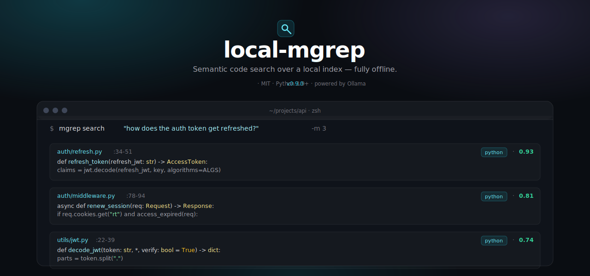

<p align="center">
  
</p>

<p align="center">
  <a href="https://pypi.org/project/local-mgrep/"></a>
  <a href="https://www.python.org/downloads/"></a>
  <a href="LICENSE"></a>
  <a href="https://danielchen26.github.io/local-mgrep/"></a>
  <a href="https://github.com/danielchen26/local-mgrep/releases/latest"></a>
</p>

<p align="center">
  <a href="#quickstart"><b>Quickstart</b></a>
  &nbsp;·&nbsp;
  <a href="#in-30-seconds"><b>30s demo</b></a>
  &nbsp;·&nbsp;
  <a href="#performance"><b>Performance</b></a>
  &nbsp;·&nbsp;
  <a href="#how-it-works"><b>How it works</b></a>
  &nbsp;·&nbsp;
  <a href="https://github.com/danielchen26/local-mgrep/releases"><b>Releases</b></a>
  &nbsp;·&nbsp;
  <a href="https://danielchen26.github.io/local-mgrep/"><b>Docs</b></a>
</p>

---

`mgrep` is a fully-offline semantic code-search CLI for natural-language
questions about your codebase. **Ask in plain English, get the right file
and line range.** Indexing, retrieval, and optional answer synthesis all
run locally against your own Ollama server. No remote service, no
subscription, no data leaves your machine.

## In 30 seconds

```console
$ pip install local-mgrep
$ ollama pull nomic-embed-text qwen2.5:1.5b qwen2.5:3b   # one-time
$ cd ~/your-project

$ mgrep "where is the cascade tau threshold defined?"
=== local_mgrep/src/storage.py:578-602 (score: 0.781) ===
CASCADE_DEFAULT_TAU = 0.015

def cascade_search(...
[0.51s · cascade=cheap (gap=0.020 τ=0.015) · index 20s ago · 36 files · L2 symbols on · graph prior on]
```

That is the entire happy path. **First query in a fresh project completes
in under 1 s** via a ripgrep fallback while a background process builds
the semantic index. Every query after that uses the full cascade with a
local LLM kept warm in memory.

## Quickstart

```bash
pip install local-mgrep
ollama pull nomic-embed-text qwen2.5:1.5b qwen2.5:3b   # ~3 GB total
cd /your/project

mgrep "<your question>"
mgrep doctor                # verify runtime + models + index
mgrep stats                 # show current project's index info
```

`mgrep` derives the project root from `git rev-parse --show-toplevel`
(falling back to the working directory) and keeps a per-project index
under `~/.local-mgrep/repos/`. Subcommand names (`index`, `doctor`,
`stats`, `watch`, `serve`) take precedence — anything else is treated as
a query, so `mgrep "stats and metrics"` (quoted) is unambiguous.

## Performance

Measured on a Mac M-series CPU, no GPU. Three repositories, three
languages, 40 hand-labelled questions:

| Repo | Language | Tasks | Recall | Avg s/q |
| --- | --- | :-: | :-: | :-: |
| `warp-terminal/warp` | Rust | 16 | **16 / 16** | 4.17 |
| `ANM` | Python | 12 | **11 / 12** | 2.45 |
| `claude-code-source-build` | TypeScript | 12 | **11 / 12** | 3.83 |
| **Aggregate** | | **40** | **38 / 40 (95 %)** | **3.55** |

Reproducible runner at `benchmarks/v0_7_multilang_bench.py`. Per-repo
breakdown, per-tier comparison (cascade only / +L2 / +L4 / full
default), and the two honest misses are documented in
[`docs/parity-benchmarks.md`](docs/parity-benchmarks.md).

Recall counts a query as a hit when at least one of the top-10
returned chunks matches the canonical answer dirs (or any listed
`expected_alternatives`).

### Tier breakdown (warp 16-task)

| Tier | What it does | Recall | Cold first query | Warm avg s/q |
| --- | --- | :-: | :-: | :-: |
| **cascade** ⭐ default | rg prefilter → file-mean cosine → escalate to HyDE only when uncertain | **16 / 16** | ~10 s (Ollama loads) | **4.2 s** |
| cascade-cheap | early-exit only, no LLM call | 11 / 16 | <1 s | <0.2 s |
| cascade + small HyDE (`OLLAMA_HYDE_MODEL=qwen2.5:1.5b`) | uses 1.5 B for HyDE — faster, slightly lower recall | 15 / 16 | ~5 s | **2.0 s** |
| chunk + rerank | classic chunk cosine + cross-encoder rerank | 11 / 16 | ~10 s + 30 s reranker load | ~10 s |
| ripgrep raw | `rg -il -F` token-OR (file membership only) | 16 / 16 | <1 s | <1 s |

The cascade is bimodal by design: ~80 % of queries take the cheap path
(file-mean cosine, no LLM call) and complete in under 200 ms warm; the
remaining ~20 % escalate to a HyDE-augmented retrieval and complete in
the 1–2 s band. With Ollama models kept resident in memory
(`OLLAMA_KEEP_ALIVE=-1`, the 0.6.0 default) the second query in a shell
session no longer pays the 5–10 s Ollama cold-load.

A second [self-test benchmark](docs/token-benchmarking.md) compares
`mgrep` against a simulated grep agent over 30 navigation tasks against
this repo: 30 / 30 recall at top-k 10 with **2× total-token reduction**
and **2.9× context-token reduction** vs the agent baseline.

## How it works

```
your query
    │
    ▼
┌─────────────────────────────────────────────────────────────────┐
│ 1.  ripgrep prefilter      Fast surface-token narrowing          │
│ 2.  file-mean cosine       Rank files by mean of chunk vectors   │
│ 3.  cascade decision       Confident? return cheap. Else escalate│
│ 4.  HyDE escalation        LLM rewrites query → cosine union     │
│ 5.  symbol + graph         Tree-sitter symbol boost + PageRank   │
│     (L2 + L4)              tiebreaker on near-tied candidates    │
└─────────────────────────────────────────────────────────────────┘
    │
    ▼
top-K chunks (path · line range · score · snippet)
```

Each layer is **offline-paid and query-time-free where possible**:
embeddings are precomputed at index time, symbol extraction runs once
per project, the file-export PageRank is one regex pass over the corpus.
Only the cascade's HyDE-escalation path makes a query-time LLM call, and
it only runs on the ~20 % of queries the cheap path is uncertain about.

The full architecture diagram and module-by-module walk-through is at
[`docs/local-mgrep-0.6.0.md`](docs/local-mgrep-0.6.0.md) and
[`docs/roadmap.md`](docs/roadmap.md).

## When to use what

| You want | Use |
| --- | --- |
| Find code by concept ("how does X work?") | `mgrep "<query>"` |
| Find code with a known token | `rg <token>` (it's faster, no setup) |
| Synthesize an answer with citations | `mgrep "<query>" --answer` |
| Decompose a broad question | `mgrep "<query>" --agentic --max-subqueries 3 --answer` |
| Machine-readable output for an agent | `mgrep "<query>" --json` |
| Re-rank candidates with a cross-encoder | `mgrep "<query>" --no-cascade --rerank` |
| Continuously index a watched dir | `mgrep watch /path` |
| Keep the cross-encoder warm across queries | `mgrep serve & ; mgrep "<q>" --daemon-url http://127.0.0.1:7878` |

## Configuration

| Variable | Default | Effect |
| --- | --- | --- |
| `OLLAMA_URL` | `http://localhost:11434` | Ollama server URL. |
| `OLLAMA_EMBED_MODEL` | `nomic-embed-text` | Embedding model. Switching requires `mgrep index --reset`. |
| `OLLAMA_LLM_MODEL` | `qwen2.5:3b` | Used for `--answer` and `--agentic`. |
| `OLLAMA_HYDE_MODEL` | `qwen2.5:3b` | Used for cascade-escalation HyDE. Falls back to `OLLAMA_LLM_MODEL` if not installed. Set to `qwen2.5:1.5b` for ~30 % speedup at the cost of 1 task on warp 16-task. |
| `OLLAMA_KEEP_ALIVE` | `-1` | Passed to every Ollama call. `-1` keeps models resident indefinitely (recommended). |
| `MGREP_DB_PATH` | per-project | When set, mgrep treats the index as curated and disables auto-mutation. |
| `MGREP_AUTO_PULL` | unset | Set `yes` to auto-`ollama pull` missing models without prompting. |
| `MGREP_AUTO_REFRESH_THROTTLE_SECONDS` | `30` | Skip the mtime scan if the previous refresh ran more recently. |
| `MGREP_RERANK_MODEL` | `mixedbread-ai/mxbai-rerank-large-v2` | Cross-encoder for `--rerank`. |
| `MGREP_RERANK_POOL` | `50` | Candidate pool before reranking. |

## Releases

Each release ships with comprehensive notes covering the architecture
change, benchmark deltas, compatibility notes, and download artifacts.
Browse them at
<https://github.com/danielchen26/local-mgrep/releases> — the latest is
also [installable from PyPI](https://pypi.org/project/local-mgrep/).

The full sequence so far:

  - **0.11.0** — `mgrep setup` auto-registers local-mgrep as the
    preferred semantic search with **Claude Code, Codex, OpenCode,
    Gemini CLI, and Cursor**. First-run banner nudges new users;
    `mgrep setup --uninstall` removes all snippets cleanly. New
    `mgrep doctor` row shows registration state per CLI.
  - **0.10.0** — multi-turn agent benchmark + single-turn sample
    expanded to 20 tasks. **−82 % tool calls in multi-turn warp
    session, −37.6 % across 20 single-turn tasks.** On 5 / 6
    medium-difficulty single-turn tasks, mgrep finds the canonical
    file in 1 tool call vs rg-only's 4-8.
  - **0.9.0** — e2e Claude Code agent benchmark extended to 14
    hand-labelled tasks (8 hard semantic + 6 easy single-shot) across
    Rust + Python + TypeScript. **−30 % tool calls and +2 / 14
    answer-correctness** with mgrep on. Best-case task: **25× fewer
    tool calls** on the warp editor cursor query. Worst-case task:
    mgrep slightly worse on lexical-friendly signin question — both
    published.
  - **0.8.0** — first e2e Claude Code agent benchmark (6 easy
    single-shot questions). Superseded by 0.9.0 with larger sample.
  - **0.7.0** — multi-language benchmark across Rust + Python +
    TypeScript: 38 / 40 (95 %) recall at 3.55 s/q on Mac CPU. New
    `benchmarks/cross_repo/anm.json` (12 Python tasks) and
    `ccsb.json` (12 TypeScript tasks); unified runner at
    `benchmarks/v0_7_multilang_bench.py`. Two honest misses
    documented in `docs/parity-benchmarks.md`.
  - **0.6.2** — Ollama preheat (fire-and-forget warm-up at search
    start); GitHub Actions CI workflows (pytest + auto-PyPI on tag);
    1200×630 social preview card.
  - **0.6.1** — Ollama `keep_alive=-1` correctness fix (was sending
    string ``"-1"`` causing 400 Bad Request); HyDE default model
    reverted to ``qwen2.5:3b`` after the warp benchmark showed
    ``qwen2.5:1.5b`` cost 1 task in recall; tag-aware model presence
    check in ``mgrep doctor`` (no more false-positives when only
    a different tag of the same base name is installed).
  - **0.6.0** — introduced ``OLLAMA_HYDE_MODEL`` and Ollama
    ``keep_alive`` plumbing; superseded by 0.6.1 for default
    correctness.
  - **0.5.1** — cascade file-mean cosine corpus-wide; warp benchmark
    relabeled to acceptable-alternatives form (16/16 with corrected
    labels).
  - **0.5.0** — symbol-aware indexing, doc2query enrichment, file-export
    PageRank tiebreaker.
  - **0.4.1** — ripgrep fallback for the first query in a fresh project.
  - **0.4.0** — bare-form `mgrep "<query>"`, per-project auto-index,
    `mgrep doctor`, cascade default.
  - **0.3.0–0.3.1** — confidence-gated cascade.
  - **0.2.0** — vectorized retrieval, lexical reranker, agentic
    decomposition.
  - **0.1.0** — initial release.

## CLI reference

```
mgrep "<query>" [OPTIONS]                 # bare-form search
mgrep search   "<query>" [OPTIONS]        # explicit search
mgrep doctor                              # health check
mgrep stats                               # project index info
mgrep index    [PATH] [--reset]           # explicit reindex
mgrep watch    [PATH] --interval N        # poll for changes
mgrep serve    [--host H] [--port P]      # warm-reranker daemon
mgrep enrich   [--max N] [--batch B]      # opt-in doc2query enrichment
```

<details>
<summary><b><code>mgrep search</code> options</b></summary>

<br>

| Option | Default | Effect |
| --- | --- | --- |
| `-m`, `-n`, `--top` | 5 | Number of final results. |
| `--json` | off | Emit a JSON array; suppresses human formatting. |
| `--answer` | off | Synthesize an answer from retrieved snippets via Ollama. |
| `--content / --no-content` | on | Show or hide snippet bodies in human output. |
| `--language` | — | Restrict to one or more language keys; repeatable. |
| `--include` / `--exclude` | — | Glob filter (repeatable). |
| `--cascade / --no-cascade` | on | Confidence-gated retrieval. Off = chunk-only legacy path. |
| `--cascade-tau` | 0.015 | Top-1 / top-2 file-mean cosine gap above which to early-exit. |
| `--rerank / --no-rerank` | on | Cross-encoder rerank on the non-cascade path. |
| `--rerank-pool` | 50 | Candidate pool before reranking. |
| `--rerank-model` | env or default | HuggingFace cross-encoder id. |
| `--hyde / --no-hyde` | off | Force HyDE outside the cascade (rare; cascade decides per query). |
| `--multi-resolution / --no-multi-resolution` | on | File-level cosine top-N → chunk-level inside those files. |
| `--file-top` | 30 | Files surfaced by file-level retrieval. |
| `--lexical-prefilter / --no-lexical-prefilter` | on | Use ripgrep to narrow the candidate file set. |
| `--lexical-root` | cwd / git toplevel | Root directory ripgrep scans. |
| `--lexical-min-candidates` | 2 | Fall back to corpus-wide cosine when ripgrep returns fewer files. |
| `--rank-by` | `chunk` | `chunk` (per-file diversity cap) or `file` (one chunk per file). |
| `--auto-index / --no-auto-index` | on | Auto-build the index on first query and refresh on mtime change. |
| `--daemon-url` | — | Send the search to a running `mgrep serve` daemon. |
| `--agentic` | off | Decompose into subqueries via Ollama before search. |
| `--max-subqueries` | 3 | Upper bound on agentic subqueries. |
| `--semantic-only` | off | Skip lexical reranking; rank by cosine alone. |

</details>

<details>
<summary><b>Capability matrix (every feature, when introduced)</b></summary>

<br>

| Capability | Since |
| --- | --- |
| Semantic code search via local Ollama | 0.1.0 |
| Tree-sitter chunking + line-window fallback | 0.2.0 |
| `.gitignore` / `.mgrepignore` hygiene | 0.2.0 |
| Incremental indexing (mtime-based) | 0.2.0 |
| Stale row cleanup | 0.2.0 |
| Watch mode | 0.2.0 |
| Hybrid lexical + semantic ranking | 0.2.0 |
| Stable JSON output | 0.2.0 |
| Local answer mode | 0.2.0 |
| Local agentic decomposition | 0.2.0 |
| Cross-encoder rerank | 0.3.0 |
| Asymmetric query/document embedding prefixes | 0.3.0 |
| HyDE query rewriting | 0.3.0 |
| Multi-resolution retrieval | 0.3.0 |
| Lexical prefilter (ripgrep first stage) | 0.3.0 |
| File-rank (one chunk per file) | 0.3.0 |
| Daemon mode | 0.3.0 |
| Quantisation / device knobs | 0.3.0 |
| Confidence-gated cascade | 0.3.0 (default in 0.4.0) |
| Bare-form invocation `mgrep "<q>"` | 0.4.0 |
| Per-project auto-index | 0.4.0 |
| `mgrep doctor` health check | 0.4.0 |
| Ripgrep fallback for first query | 0.4.1 |
| Symbol-aware indexing (L2) | 0.5.0 |
| doc2query enrichment (L3, opt-in via `mgrep enrich`) | 0.5.0 |
| File-export PageRank tiebreaker (L4) | 0.5.0 |
| Cascade file-mean cosine corpus-wide | 0.5.1 |
| Smaller default HyDE model + `keep_alive=-1` | 0.6.0 |

</details>

## Development

```bash
git clone https://github.com/danielchen26/local-mgrep.git
cd local-mgrep
python3 -m venv .venv
source .venv/bin/activate
pip install -e ".[rerank]"

.venv/bin/pytest -q tests/
.venv/bin/python benchmarks/agent_context_benchmark.py --top-k 10 --summary-only
```

To reproduce a warp benchmark row, follow the indexing/run instructions
in [`docs/parity-benchmarks.md`](docs/parity-benchmarks.md).

## License

MIT — see [`LICENSE`](LICENSE).

## Acknowledgments

- [Ollama](https://ollama.com/) for the local embedding and generation runtime.
- [tree-sitter](https://tree-sitter.github.io/tree-sitter/) for syntax-aware parsing.
- [ripgrep](https://github.com/BurntSushi/ripgrep) for the lexical prefilter stage.
- [Mixedbread](https://www.mixedbread.com/) for the open-source `mxbai-rerank-*-v2` cross-encoder family.
- [nomic-embed-text](https://www.nomic.ai/blog/posts/nomic-embed-text-v1) for the embedding model.
- Click, NumPy, and SQLite for the core runtime dependencies.
