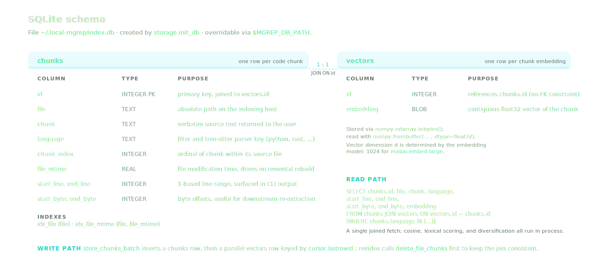
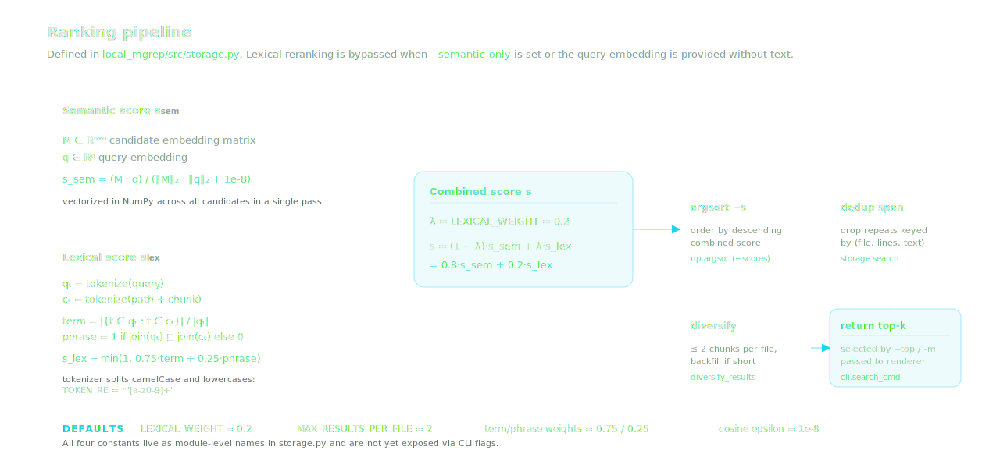

# local-mgrep 0.2.0 — capability guide

This document describes what the 0.2.0 release implements. It complements the
[CLI reference](../README.md#cli-reference) in the project README and the
[benchmark protocol](token-benchmarking.md).

## Scope

`local-mgrep` is a command-line tool that builds a SQLite vector index from a
repository's source files and answers natural-language queries with line-cited
snippets. Indexing, retrieval, lexical reranking, span deduplication, per-file
diversification, and optional answer synthesis run in process against a local
Ollama server. No network calls outside Ollama are made by the core
workflow.

The 0.2.0 release does not implement hosted account management, a remote
index, or paid web search; these are out of scope rather than deferred work.

## Component overview

| Module | Responsibility |
| --- | --- |
| `local_mgrep/src/cli.py` | Click-based CLI entry points (`index`, `search`, `stats`, `watch`) and result rendering. |
| `local_mgrep/src/indexer.py` | File discovery, ignore-rule application, tree-sitter / fallback chunking. |
| `local_mgrep/src/embeddings.py` | HTTP client for the Ollama embeddings API (batch and single-text endpoints). |
| `local_mgrep/src/storage.py` | SQLite schema, vectorized cosine search, lexical reranker, diversification. |
| `local_mgrep/src/answerer.py` | HTTP client for the Ollama generation API used by `--answer` and `--agentic`. |
| `local_mgrep/src/config.py` | Environment-variable configuration. |

## Indexing

`mgrep index` performs five operations on the given path:

1. **Discover.** Walk the path for files whose extension is in
   `SUPPORTED_EXTENSIONS` (Python, JavaScript, TypeScript, TSX/JSX, Go, Rust,
   Java, C/C++, C#, Ruby, PHP, Swift, Kotlin, Scala, Vue, Svelte). Apply
   `.gitignore`, `.mgrepignore`, and a built-in skip-set covering `.git`,
   `.venv`, `node_modules`, `dist`, `build`, `target`, `vendor`, and similar
   directories.
2. **Chunk.** Where a tree-sitter grammar is installed for the detected
   language, walk the AST and emit nodes whose span is below 50 lines and
   1000 characters and whose body contains at least 3 lines. When no grammar
   is available the file is split with a deterministic line-window splitter.
3. **Embed.** Send chunks to Ollama in batches of 10. The client first attempts
   `POST /api/embed` and falls back to per-chunk `POST /api/embeddings` if the
   batch endpoint is unavailable for the running model.
4. **Persist.** For each chunk, insert one row into `chunks` (file, language,
   line and byte ranges, file mtime) and one row into `vectors` (the embedding
   as a contiguous float32 BLOB). The two rows share an `id`.
5. **Reconcile.** When `--incremental` is set (the default), reindex only files
   whose disk mtime is newer than the stored `file_mtime`, and call
   `delete_missing_files` to drop rows whose source file no longer exists
   beneath the indexed root. Pass `--full` to reindex every discovered file
   without the mtime check; pass `--reset` to delete the database file before
   indexing.

`mgrep watch` repeats the same logic on a polling interval (default 5 seconds)
until interrupted.

## Storage

Two tables share a primary key. `chunks` stores everything required to display
a result and to filter candidates before scoring. `vectors` stores the
embedding as a raw float32 buffer, read with
`numpy.frombuffer(..., dtype=float32)` at query time. There is no declared
foreign key; the join is enforced by `storage.store_chunks_batch` and
`storage.delete_file_chunks`.

Two B-tree indexes accelerate file-level operations:

- `idx_file (file)` — used by `delete_file_chunks` and `get_indexed_files`.
- `idx_file_mtime (file, file_mtime)` — used during incremental reconciliation.

## Querying

`mgrep search` runs the query through five stages:

1. **Embed.** The query text is embedded with the same model used at index
   time. Mismatched embedding models are not detected automatically; reindex
   with `--reset` after changing `OLLAMA_EMBED_MODEL`.
2. **Cosine.** The candidate matrix is loaded with one joined SQL fetch.
   Cosine similarity against the query vector is computed across all rows in
   a single NumPy pass.
3. **Lexical adjustment.** When the query text is provided and
   `--semantic-only` is not set, a token-and-phrase overlap score is computed
   against `path + chunk` and combined as
   `0.8 · cosine + 0.2 · lexical`. The tokenizer splits camelCase and lowercases.
4. **Span deduplication.** Candidates whose `(file, start_line, end_line, text)`
   tuple has already been seen are skipped.
5. **Diversification.** A linear pass admits up to two candidates per file;
   the remaining slots are filled from the overflow.

Filters (`--language`, `--include`, `--exclude`) are applied either as a
`WHERE` clause (for language) or as a Python-side path-pattern filter (for
include/exclude globs) before scoring.

### Result shape

| Field | Type | Notes |
| --- | --- | --- |
| `path` | string | Absolute file path on the indexing host. |
| `start_line`, `end_line` | integer | Inclusive 1-based line range. |
| `language` | string | Tree-sitter language key or extension-derived key. |
| `score` | float | Combined score from step 3. |
| `snippet` | string | Verbatim source text of the chunk. |

`--json` renders this as a JSON array with `indent=2`. The same dictionary
structure is used internally by `--answer` and `--agentic`.

## Optional answer and agentic modes

`--answer` passes the ranked snippets as context to a local Ollama generation
model. The fixed system prompt instructs the model to cite file paths and line
ranges, to say so when an answer is not present in the snippets, and not to
ask follow-up questions. The original ranked sources are still printed below
the synthesized answer.

`--agentic` precedes the search with a generation step that decomposes the
query into up to `--max-subqueries` related queries (default 3). Each
subquery is searched independently; results are merged by score before
rendering. `--agentic` and `--answer` can be combined.

Neither mode is invoked unless the corresponding flag is set; the core
retrieval workflow does not depend on a generation model.

## Configuration

Configuration is read from environment variables on every invocation; there
is no config file.

| Variable | Default | Effect |
| --- | --- | --- |
| `OLLAMA_URL` | `http://localhost:11434` | Base URL of the Ollama server. |
| `OLLAMA_EMBED_MODEL` | `mxbai-embed-large` | Embedding model used at index time and query time. |
| `OLLAMA_LLM_MODEL` | `qwen2.5:3b` | Generation model used by `--answer` and `--agentic`. |
| `MGREP_DB_PATH` | `~/.local-mgrep/index.db` | SQLite index location. |

For per-project indexes, set `MGREP_DB_PATH` to a project-local file before
invoking `mgrep`.

## Performance characteristics observed in 0.2.0

The following changes were made between 0.1.0 and 0.2.0. They are listed for
reference; their effect on a specific workload depends on repository size and
the embedding model.

- Indexing uses `embed_batch` when the embedder exposes it.
- Cosine scoring uses a NumPy matrix multiplication against the candidate
  matrix instead of a per-row Python loop.
- A single joined SQL fetch replaces two round-trips per chunk.
- A lexical token + phrase reranker is blended with the cosine score; pure
  vector scoring remains available via `--semantic-only`.
- The result selection step caps repeated chunks from the same file at two
  before filling the remaining top-k slots.
- `--language`, `--include`, and `--exclude` reduce the candidate set before
  scoring.

## Benchmark

The current deterministic benchmark on this repository, at top-k 10, is:

| Metric | local-mgrep | grep-agent baseline |
| --- | --- | --- |
| Expected-file recall | 30 / 30 | 30 / 30 |
| Tool calls | 30 | 227 |
| Estimated total-token reduction | 2.00× | (baseline) |
| Context-token reduction | 2.90× | (baseline) |

See [`token-benchmarking.md`](token-benchmarking.md) for the full results
table, the protocol, and explicit limitations.
